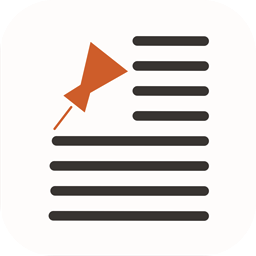

<h1 align="center">NewsClient - Open Source News Reader</h1>

## About the App
NewsClient is a news reader, that provides not only current top News articles in the countries of your interest, but your personal collection of news articles. NewsClient uses the News API to download the news data. 

With NewsClient, you can:
- Check and browse current top news articles from the countries specified;
- Detailed news information is available in a variety of categories, and pinned to your collection;
- Add articles into your personal collection, or delete any of them by swiping;
- Search worldwide news articles with keywords.

> Please note that you need to supply your own News API key to run this App either on your simulator or devices. As this App is open source currently, a paid tier api key can not be included. Furthermore, even though News API does not charge developers for accessing their database, you are encouraged to cite an attribution link when you make your work public. Please refer to the [webpage](https://newsapi.org/pricing) for more details.

## Goals of this Project
NewsClient should help you as a reference for your development if you are interested in programmatically auto-layout. Whether you just started iOS development or want to learn more about Swift by seeing in action, hopefully this project could be of some help during your journey. The original purpose of this project is to extend my previous work on App Store Mockup. But sooner as I was developing this App, I could not find a good News reader either for polyglots, or for users who want to browse news articles from different countries. NewsClient covers basic principles of iOS development:

- Programming concepts such as closures, generics & extensions;
- Swift language features such as codables;
- Persisiting data;
- Using various UIKit classes;
- Network requests;
- Using 3rd part REST-APIs;
- Using 3rd party libraries via CocoaPods.

The architecture is kept simple by using [Apple's recommended MVC pattern](https://developer.apple.com/library/content/documentation/General/Conceptual/DevPedia-CocoaCore/MVC.html). This architecture is fine for a small projects like this one. For complex apps there are better options, such as MVVM, and etc. The chosen architecture may for example limit the testability of the project, but then again for simplicty sake there are no unit tests present at all. Additionally the app uses singeltons for all services, including network and persistence. This further hinders testing. A better approach to enable this would be dependency injection that I am currently studying, and this project will be updated as I will be gaining more skills.

## Getting Started
In order to get started, fork the project and clone it to your local machine. In order to open the project and in oder to run it, you will need to have the latest Apple developer tool Xcode installed. For libraries this app uses the dependency manager [Cocoa Pods](https://cocoapods.org). Pods are not checked into the repository, so you will have run `pod install` after cloning. 

## Contributing

We looking forward to receiving your contributions. 

Additionally you may also assist as a beta tester. Periodically test-builds will become available via Testflight. In order to take part in testing those submit an email address used as an Apple-ID to [c.h.chen.developer@gmail.com](mailto:c.h.chen.developer@gmail.com) to be added to the list of testers.

## Future Developments
I still have some thoughts about developing this App with the following features, including but not limited to:
* [ ] Language localization;
* [ ] Allows users to flexibly add the countries of their interest in Today, and Categories;
* [ ] Share news articles with other people;
* [ ] Dependency Injection;
* [ ] Integrate XCTests and Bitrise/[Travis](https://travis-ci.org);
* [ ] Integrate Firebase Crashlytics/[Fabric](https://get.fabric.io).

If you have other good ideas, please kindly contact me via [c.h.chen.developer@gmail.com](mailto:c.h.chen.developer@gmail.com).
